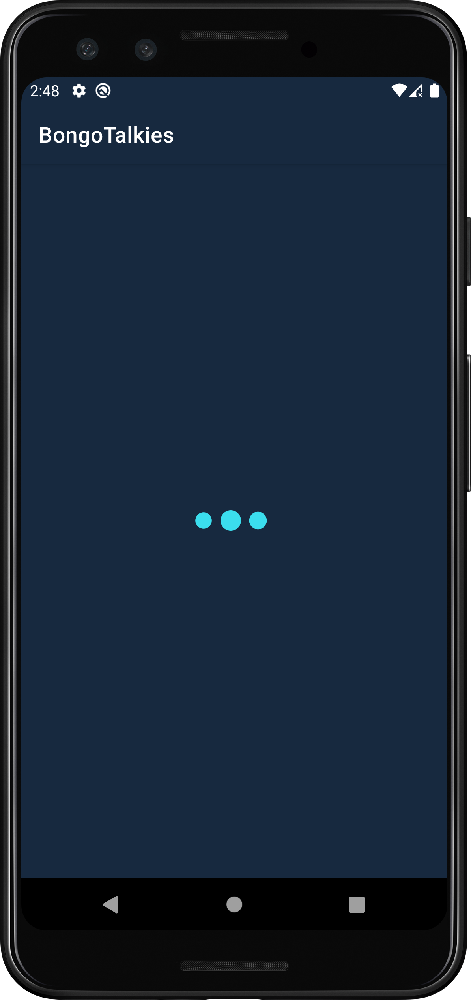
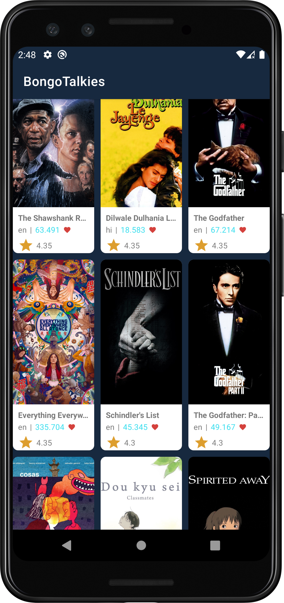

# BongoTalkies
##### App UI Screens
 &emsp;  &emsp;  &emsp; 

#### As per the requirement I completed this project using MVVM (Model View Viewmodel) architechture with unit testing. 
### Tools & libraries used in this project: 
- Retrofit
- Glide
- SpinKit
- Matrial Ui Libraries
- Android Lifecycles
- Databinding 
- Junit
- Mockito
- Mockwebserver

#### Note: Additionally I handled some extra tasks such as network accessibility check & render proper UI state based on it, Api unit testing & response handling.
